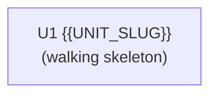

# Dependencies & Build Order — {{PLAN_ID}}

> How the units depend on each other and the order to build them. See `docs/settings/rules/inception-decomposition.md` §5–§6.

## Dependency Matrix

| Unit | Depends on | Integration method |
|------|------------|--------------------|
| U1 {{UNIT_SLUG}} | — | — (walking skeleton) |

<!-- Integration method = shared data | sync call | event | shared library -->

## Integration Points

| Initiator | Target | Method | Frequency |
|-----------|--------|--------|-----------|
| | | | |

## Dependency Graph

## Build Order

> Walking skeleton first, then dependencies-first topological order; ties broken by priority then subdomain class. Units in the same step with no shared dependency may run in parallel.

1. **U1 {{UNIT_SLUG}}** — walking skeleton (thinnest end-to-end slice through all seams)
2. <!-- next unit(s); group parallel-capable units together -->

**Acyclic check:** confirmed no circular dependencies. <!-- A cycle means a boundary is wrong — re-cut. -->
